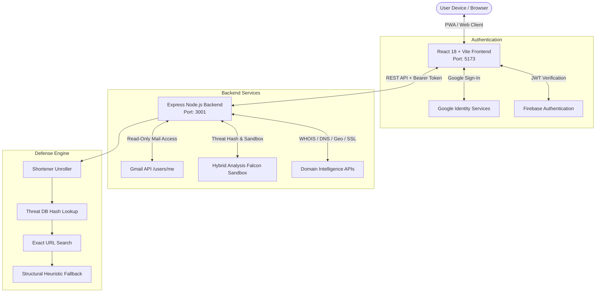

# 🛡️ SecureMail — AI-Powered Gmail Security & Threat Intelligence Scanner

<p align="center">
  
</p>

<p align="center">
  <strong>Next-Generation Phishing Link Detector, Attachment Scanner & Domain Intelligence Client for Gmail</strong>
</p>

<p align="center">
  
  
  
  
  
  
  
</p>

---

## 🌟 Overview

**SecureMail** is a modern, high-performance security client designed for **Smart India Hackathon 2026**. It empowers everyday users and organizations to inspect their Gmail inbox safely. With one click, SecureMail analyzes incoming email links, investigates sender domains, and scans attachments for phishing, malware, and credential-harvesting threats.

Built with strict privacy-by-design principles: SecureMail uses the restricted **`gmail.readonly`** scope, stores temporary tokens in memory/session only, and never writes email contents or credentials to any database.

---

## 🚀 Live Demo & Endpoints

| Resource | URL |
|---|---|
| 🌐 **Frontend (Vercel)** | [https://sih-2026-iota-rouge.vercel.app](https://sih-2026-iota-rouge.vercel.app) |
| 🌐 **Custom Domain** | [https://www.sih26106.duckdns.org](https://www.sih26106.duckdns.org) |
| ⚙️ **Backend API (Render)** | [https://sih-2026-backend-re9s.onrender.com](https://sih-2026-backend-re9s.onrender.com) |
| 🩺 **API Health Check** | [https://sih-2026-backend-re9s.onrender.com/health](https://sih-2026-backend-re9s.onrender.com/health) |
| 💻 **GitHub Repository** | [https://github.com/raintry1/SIH-2026](https://github.com/raintry1/SIH-2026) |

---

## ✨ Key Features

### 1. 🔍 Phishing Link Detection & Multi-Engine Threat Intel
- **Shortener Unrolling**: Resolves 24+ shortening services (TinyURL, Bitly, t.co, etc.) to uncover real destination targets before inspection.
- **Hybrid Analysis (Falcon Sandbox v2)**: Real-time queries against extensive threat intelligence databases and sandbox detonations.
- **Dual-Window Recency Aggregation**: Weighs fresh reports (2-year window) with fallback verification (5-year window) to eliminate false positives on trusted domains.
- **Structural Heuristic Fallback**: Zero-API-call heuristic engine detecting raw IP hosts, suspicious non-standard ports, percent-encoding tricks, and known phishing paths (`/login.php`, `/ReportViewer.aspx`, `/update-account`).

### 2. 🌐 Deep Domain Intelligence Engine
- **WHOIS & Age Auditing**: Registrar, creation date, and domain age analysis.
- **DNS Records**: Resolves A, MX, TXT, and NS records via networkcalc.
- **IP Geolocation & Threat Scoring**: Real-world location, hosting ISP, and proxy/VPN/Tor exit node identification.
- **SSL Certificate Verification**: Public certificate authority auditing via `crt.sh`.
- **Free-Hosting & Disposable Subdomain Tracking**: Detects brand-spoofing setups on platforms like Netlify, Vercel, Firebase, GitHub Pages, etc.

### 3. 📎 Attachment Malware & Hash Scanner
- **SHA-256 Hash Matching**: Hashes email attachments on-the-fly and looks up malware signatures.
- **Extension Heuristics**: Flags high-risk executables (`.exe`, `.bat`, `.ps1`), macro-enabled Office files (`.docm`, `.xlsm`), and nested archives (`.zip`, `.rar`, `.7z`).

### 4. 📱 Cross-Platform Progressive Web App (PWA)
- **Install on Any Device**: Native app installation on **Windows**, **macOS**, **Android**, and **iOS**.
- **Smart Detection**: Popup appears only when browsing in regular browser tabs; automatically remains hidden when running inside the standalone installed app window.
- **Direct 1-Click Native Install**: Triggers the OS/browser native installation dialog instantly.
- **Offline Pre-caching**: Fast load times powered by Workbox service worker.

### 5. 🔐 Zero-Trust Security & Privacy
- **Read-Only Scope**: Uses `https://www.googleapis.com/auth/gmail.readonly`. The app cannot send, modify, or delete emails.
- **Stateless Tokens**: OAuth access tokens reside in `sessionStorage` and vanish when the tab closes.
- **Sanitized Rendering**: All email HTML content is cleansed with **DOMPurify** to neutralize XSS vectors.

---

## 🏗️ System Architecture



---

## 📁 Repository Structure

```
SIH-2026/
├── api/                                 # Express Backend Service
│   ├── src/
│   │   ├── middleware/
│   │   │   └── auth.js                  # Firebase ID token validation
│   │   ├── routes/
│   │   │   ├── gmail.js                 # /api/emails & /api/emails/:id
│   │   │   └── security.js              # POST /api/security/check
│   │   ├── services/
│   │   │   ├── domainIntel.js           # WHOIS, DNS, Geo, SSL & Shortener resolver
│   │   │   ├── filecheck.js             # Attachment scanner & hash verification
│   │   │   ├── gmail.js                 # Gmail API client & multipart parser
│   │   │   └── phishing.js              # Multi-engine link security pipeline
│   │   ├── firebase.js                  # Firebase Admin SDK initialization
│   │   └── server.js                    # Express app entrypoint & CORS config
│   ├── package.json
│   └── .env.example
├── web/                                 # React Frontend (Vite + Tailwind + MUI)
│   ├── public/
│   │   ├── pwa/                         # High-res PWA icons (192px, 512px, maskable)
│   │   └── favicon.svg
│   ├── src/
│   │   ├── api/
│   │   │   └── gmailApi.js              # Axios client with auth interceptors
│   │   ├── auth/
│   │   │   └── authService.js           # Firebase Auth + Google OAuth token handlers
│   │   ├── components/
│   │   │   ├── EmailDetail.jsx          # Email viewer + link verdict banner
│   │   │   ├── EmailList.jsx            # Scrollable mailbox with polling
│   │   │   ├── GmailConnector.jsx       # Reconnect button for expired tokens
│   │   │   ├── InstallPopup.jsx         # Smart cross-platform PWA install dialog
│   │   │   ├── Layout.jsx               # Navigation bar & user profile
│   │   │   └── Login.jsx                # Secure Google Sign-In card
│   │   ├── pages/
│   │   │   └── Dashboard.jsx            # Master-detail security workspace
│   │   ├── utils/
│   │   │   ├── format.js                # Timestamp & size formatters
│   │   │   └── pwaHelper.js             # PWA standalone & install state detector
│   │   ├── App.jsx                      # App router & auth state boundary
│   │   ├── index.css                    # Tailwind CSS + Aurora glow animations
│   │   └── main.jsx                     # MUI Dark Theme & App Root
│   ├── index.html                       # Manifest & early PWA prompt capturer
│   ├── vite.config.js                   # Vite + VitePWA Workbox configuration
│   ├── package.json
│   └── .env.example
├── package.json                         # Root package for monorepo start
└── README.md                            # Complete Project Documentation
```

---

## 🛠️ Tech Stack

- **Frontend**: React 18, Vite 5, Material-UI (MUI v6), Tailwind CSS, `@react-oauth/google`, Firebase Web SDK, `vite-plugin-pwa`, `dompurify`, `axios`.
- **Backend**: Node.js (ES Modules), Express 4, `firebase-admin`, `googleapis` (Gmail REST API v1), `cors`, `dotenv`, `tldts`.
- **Security & Threat Intelligence**:
  - [Hybrid Analysis](https://www.hybrid-analysis.com) Falcon Sandbox Public API v2
  - Google Safe Browsing API
  - NetworkCalc DNS API
  - IPwho.is Geolocation
  - crt.sh Certificate Transparency Logs
  - PhishDestroy Blocklists

---

## ⚡ Quick Start / Local Setup

### Prerequisites
- **Node.js**: v18.0.0 or higher
- **npm**: v9.0.0 or higher
- A Google Cloud project with Gmail API enabled and OAuth Client ID configured for `http://localhost:5173`.

---

### Step 1: Clone the Repository
```bash
git clone https://github.com/raintry1/SIH-2026.git
cd SIH-2026
```

---

### Step 2: Setup and Start Backend

```bash
cd api
npm install
cp .env.example .env
```

Configure `api/.env`:
```env
PORT=3001
CORS_ORIGINS=http://localhost:5173
FIREBASE_SERVICE_ACCOUNT_PATH=./serviceAccountKey.json
GOOGLE_CLIENT_ID=your-google-oauth-client-id
HYBRIDANALYSIS_API_KEY=your-hybrid-analysis-key
```

*Note: Place your Firebase Admin `serviceAccountKey.json` inside the `api/` directory.*

Start the backend:
```bash
npm run dev
# Server will start on http://localhost:3001
```

Verify backend health:
```bash
curl http://localhost:3001/health
# Returns: {"status":"ok","time":"..."}
```

---

### Step 3: Setup and Start Frontend

Open a new terminal window:
```bash
cd web
npm install
cp .env.example .env
```

Configure `web/.env`:
```env
VITE_FIREBASE_API_KEY=your_firebase_api_key
VITE_FIREBASE_AUTH_DOMAIN=your_project.firebaseapp.com
VITE_FIREBASE_PROJECT_ID=your_project_id
VITE_FIREBASE_STORAGE_BUCKET=your_project.firebasestorage.app
VITE_FIREBASE_MESSAGING_SENDER_ID=your_sender_id
VITE_FIREBASE_APP_ID=your_app_id
VITE_GMAIL_CLIENT_ID=your-google-oauth-client-id
VITE_API_URL=http://localhost:3001
```

Start the frontend:
```bash
npm run dev
# Vite server will launch on http://localhost:5173
```

---

## 🧪 Testing the Application

1. Open **`http://localhost:5173`** in your browser.
2. **PWA Install**: Click **"Install App"** on the bottom slide-up prompt to install SecureMail directly as a desktop or mobile application.
3. **Sign In**: Click **"Sign in with Google"** and authenticate.
4. **Inbox View**: Browse through your recent Gmail emails (synchronized in real-time every 30 seconds).
5. **Scan for Threats**: Select an email and click **"Scan for phishing"** to inspect embedded links and attachments against the threat intelligence engine.

---

## 📡 API Reference

Base URL (Local): `http://localhost:3001`  
Base URL (Production): `https://sih-2026-backend-re9s.onrender.com`

| Method | Endpoint | Headers Required | Description |
|---|---|---|---|
| `GET` | `/health` | None | Service heartbeat & health status |
| `GET` | `/api/emails` | `Authorization`, `x-gmail-token` | Fetches inbox list with sender, date, subject, snippet |
| `GET` | `/api/emails/:id` | `Authorization`, `x-gmail-token` | Fetches full message body, attachments list, and headers |
| `POST` | `/api/security/check` | `Authorization`, `x-gmail-token` | Scans all links and attachments for phishing and malware |

### Request Headers for Authenticated Endpoints:
```http
Authorization: Bearer <Firebase_ID_Token>
x-gmail-token: <Google_OAuth_Access_Token>
```

---

## 🏆 Smart India Hackathon 2026

- **Project Name**: SecureMail — Gmail Security Scanner
- **Problem Category**: Cybersecurity & Threat Intelligence
- **Repository**: [raintry1/SIH-2026](https://github.com/raintry1/SIH-2026)

---

<p align="center">
  Made with ❤️ by Team SecureMail for Smart India Hackathon 2026.
</p>